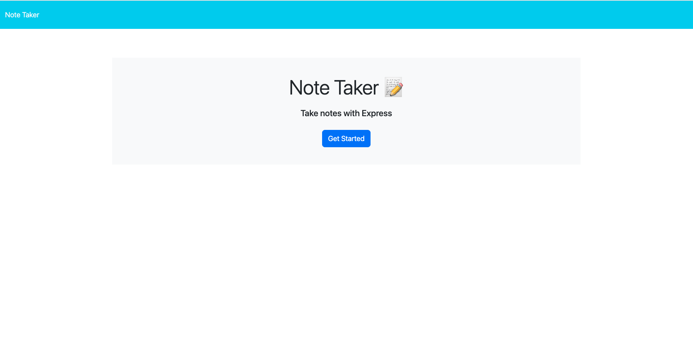
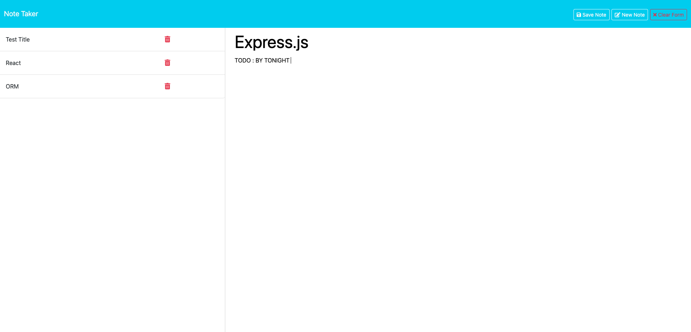

# NOTE-TAKER-Challenge-11


## Description

The Note Taker App is a simple and efficient tool for creating, viewing, and managing notes. With a clean and intuitive interface, it allows users to easily write down their thoughts, tasks, or any other information they need to remember. The app also provides functionality to save, delete, and clear notes, making it a versatile tool for personal and professional use.

## Table of Contents

* [Description](#description)

* [Usage Instructions](#usage-instructions)

* [Installation](#installation)

* [Features](#features)

* [Screenshots](#screenshots)

* [Demo](#Demo)

* [Questions](#questions)


## Usage Instructions 

1. Clone the repository to your local machine using:
   ```bash

   git clone git@github.com:Preksha2408/NOTE-TAKER-Challenge-11.git

2. Navigate to the project directory  

   cd NOTE-TAKER-Challenge-11

3. Install necessary dependencies 

   " npm install "

4. Ctrl-right-click on server.js . 

    * Open in integrated terminal

    * Type node server.js 

    * Command+click on "Server running on http://localhost:3001" (Note this an example)

## Installation 

* npm init -y 

* npm i express

* npm i uuid

* npm i fs 

## Features

* Create Notes: Users can create new notes by entering a title and text.

* Save Notes: Notes can be saved for future reference.

* View Notes: Saved notes can be viewed by clicking on them from the list.

* Delete Notes: Users can delete unwanted notes.

* Clear Form: Users can clear the input fields to reset the form.


## Screenshots 

* 

* 


## Demo 

* [Click here]()

## Questions 

For questions or further information, please contact me:

* Email - [prek.ps37@gmail.com](prek.ps37@gmail.com)

* GitHub - [Preksha2408](https://github.com/Preksha2408/NOTE-TAKER-Challenge-11.git)
